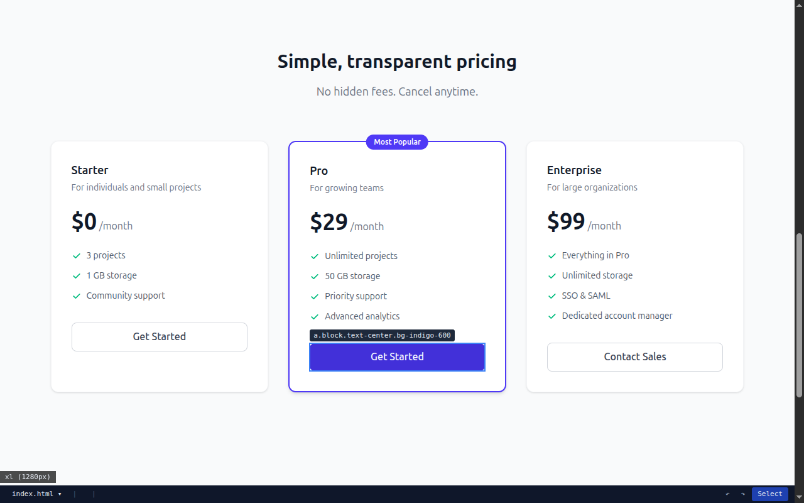
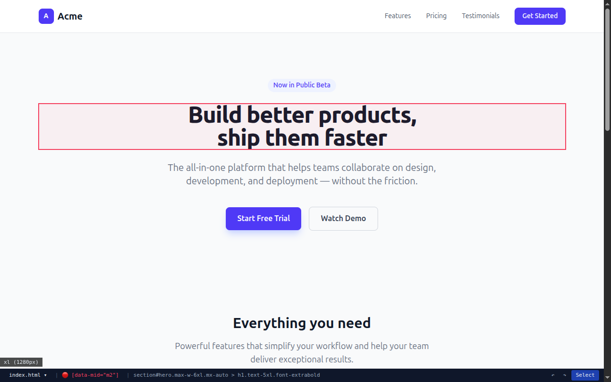
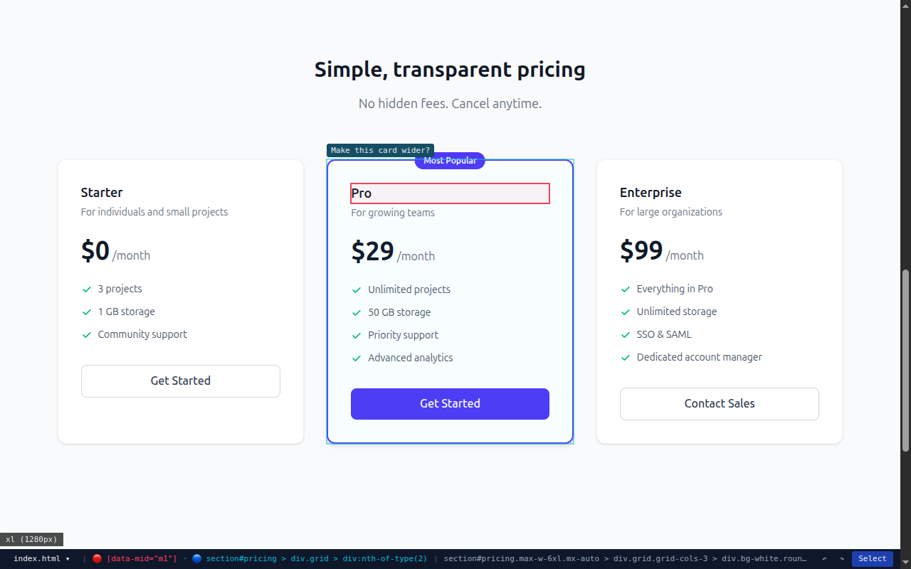
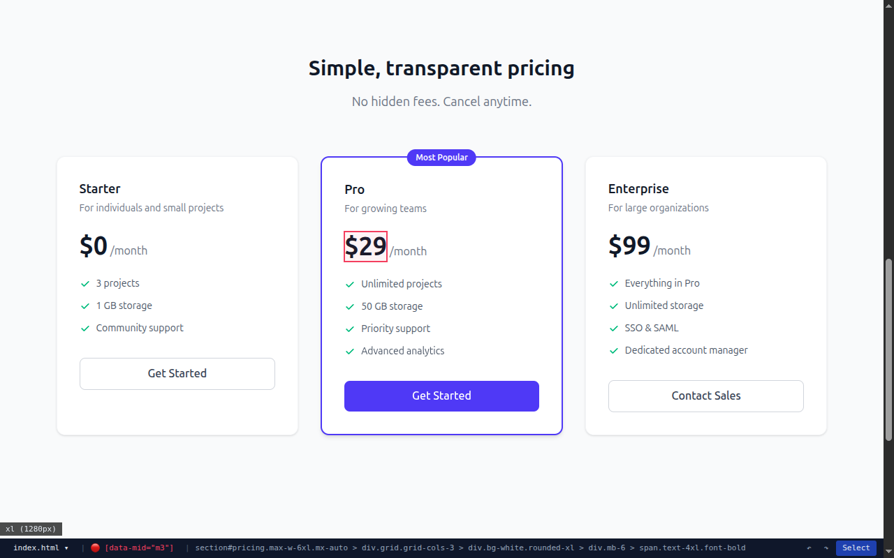
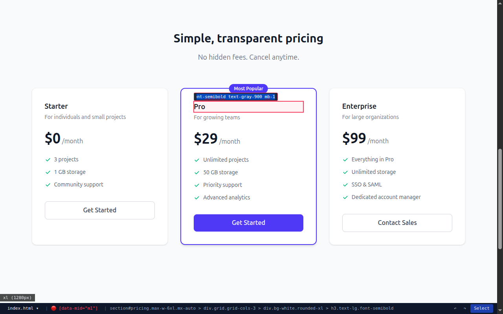
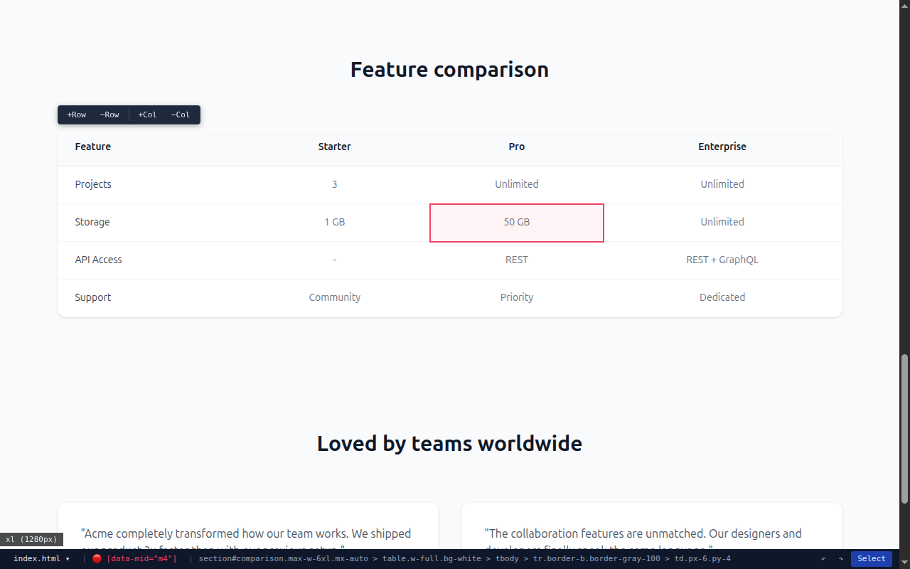
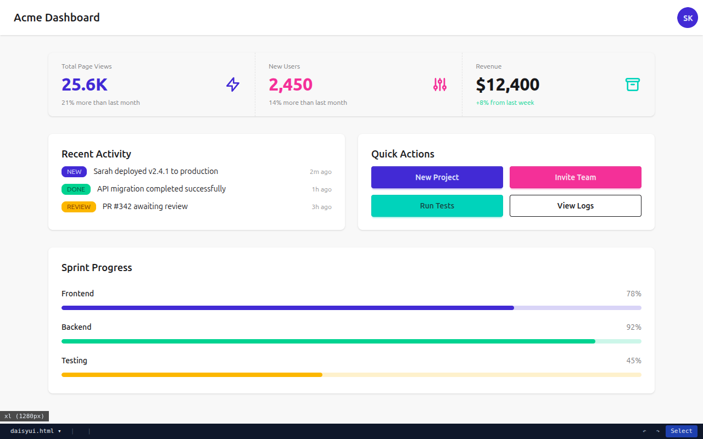

# Aceto

A local dev server with a browser overlay and MCP interface for building HTML mockups together with an AI agent.

**Not a drawing tool, not a visual editor.** Instead, a feedback loop between you and an agent:

1. Tell the agent what you want
2. The agent generates/modifies real HTML + Tailwind
3. See the result live in your browser
4. **Point at an element** and say "change this"
5. The agent understands which element you mean and modifies it

## Why Aceto

- **Token-efficient:** The agent doesn't need to read and parse the full HTML to understand what you mean. You point at an element in the browser, the agent gets a precise selector. Write tools use the current selection by default — one tool call, no roundtrip.
- **Real HTML:** No abstraction layer, no component model. The output is a plain HTML file you can read with `cat` and send by email.
- **Live feedback loop:** DOM morphing keeps scroll position and selection state. You see changes instantly without page reload flicker.

## Features

### Hover Highlighting

**User** moves the mouse over any element — a blue outline appears with the element's tag and classes.



### Element Selection

**User** clicks an element to select it (pink outline). The breadcrumb bar at the bottom shows the full DOM path. Scroll wheel navigates up/down the tree (parent/child).



### Agent Highlight

The **agent** highlights elements in cyan to communicate visually — e.g. to ask "Do you mean this one?":

```
highlight_element("section#pricing > div:nth-of-type(2)", {
  label: "Make this card wider?",
  style: "pulse"
})
```

Both selections (pink = user, cyan = agent) can be visible simultaneously.



### Inline Text Editing

**User** double-clicks a text element to edit it directly in the browser. Enter to save, Escape to cancel.



### CSS Class Editor

**User** presses `c` on a selected element to edit its Tailwind classes inline. Enter to apply, Escape to cancel.



### Table Controls

**User** selects a table cell — a floating toolbar appears with +Row, −Row, +Col, −Col controls.



### DaisyUI Support

Add component libraries via the CLI — DaisyUI components work out of the box with Tailwind v4:

```bash
aceto add daisyui
```



### More Features

- **Content shortcuts** — type `[]` or `[x]` in a cell to insert a checkbox
- **Element defaults** — define default classes for generated elements via `aceto.defaults.json`
- **Paste images** — Ctrl+V with selection inserts instantly; without selection, stages the image for agent-driven placement
- **Asset picker** — press `a` to browse and reuse previously pasted images from the assets folder
- **Yank/Paste** — press `y` to copy a selected element, `p` to paste it after another selection
- **Screenshots** — the agent captures full-page or element-level screenshots via `get_screenshot()`
- **Live reload** — DOM morphing keeps scroll position and selection state, no flickering

## What Aceto Does Not Do

- No editor — you don't edit anything yourself, you steer the agent
- No build system — an HTML file you can read with `cat`
- No framework — Tailwind v4 via CDN, optionally DaisyUI/Flowbite

## Keyboard Shortcuts (Select Mode)

| Key | Action |
|-----|--------|
| Click | Select element |
| Double-click | Inline edit text |
| Scroll wheel | Navigate depth (parent/child) |
| Tab / Shift+Tab | Next/previous cell (during table editing) |
| `c` | Edit CSS classes of selected element |
| `y` | Yank (copy) selected element |
| `p` | Paste yanked element after selection |
| `u` | Undo |
| `r` | Redo |
| `a` | Open asset picker |
| Del | Delete selected element |
| Esc | Close modal / deselect |
| `e` / Alt | Toggle select/preview mode (clears selection) |
| Ctrl+V | Paste image |

## Getting Started

```bash
# Create a new project
aceto init

# Start the dev server
aceto dev

# Export for production
aceto export --production
```

## CLI

```bash
aceto init                    # Create index.html + CLAUDE.md + aceto.md
aceto init --eject            # Write default instructions into aceto.md
aceto init --preset daisyui   # Create project with DaisyUI v5 pre-installed
aceto dev                     # Start dev server + MCP server
aceto dev about.html          # Start with a specific page
aceto dev --port 3001         # Custom port
aceto new about               # Create a new HTML page
aceto new dashboard/settings -l daisyui  # New page with DaisyUI
aceto add daisyui             # Add DaisyUI v5 to an existing project
aceto export                  # Export HTML with cleanup to dist/
aceto export --production     # Export with Tailwind CSS build
```

## Agent Instructions

On `aceto init`, a minimal `CLAUDE.md` is created that tells the agent to call `get_instructions()` via MCP. This tool returns the project's `aceto.md` if it has content, or the built-in default instructions.

To customize the instructions, run `aceto init --eject` to write the defaults into `aceto.md`, then edit to your needs.

## Element Defaults

Create an `aceto.defaults.json` in your project root to define default classes for generated elements:

```json
{
  "checkbox": "h-4 w-4",
  "img": "max-w-full h-auto rounded"
}
```

- **checkbox** — applied to checkboxes created via `[]`/`[x]` shortcuts
- **img** — applied to images inserted via paste (Ctrl+V)

The file is hot-reloaded — changes take effect immediately without restarting the server.

## Tech Stack

Bun runtime, parse5 for HTML parsing, css-select for selectors, idiomorph for DOM morphing, MCP SDK for the agent interface. No Express, no React, no build step.
